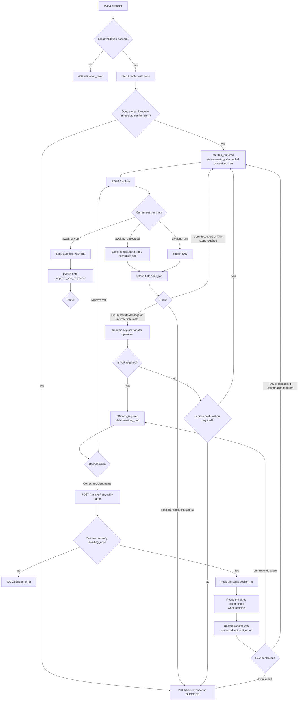

# `POST /transfer` Workflow

This document describes the end-to-end transfer flow implemented by the REST wrapper for SEPA credit transfers.

Key points:

- local request validation happens before any bank request is sent
- `/confirm` is the single continuation endpoint for TAN input, decoupled app polling, and VoP approval
- if the bank requires payee verification, the API returns `vop_required` with `state=awaiting_vop`
- `POST /transfer/retry-with-name` keeps the same `session_id` and tries to reuse the current FinTS client/dialog when possible
- reusing the dialog can save a dialog bootstrap/login step, but the bank may still require another VoP or decoupled confirmation for the corrected payment order

Typical real-world transfer path with decoupled approval and payee verification:

1. `POST /transfer` returns `409 tan_required` with `state=awaiting_decoupled`
2. the user confirms in the banking app and calls `POST /confirm`
3. the bank responds with `409 vop_required`
4. the user either approves the VoP result or retries with a corrected recipient name
5. the bank may require another decoupled confirmation
6. the flow ends with a final `TransferResponse`
